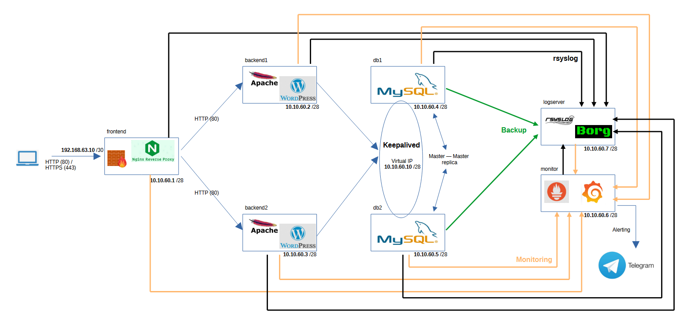
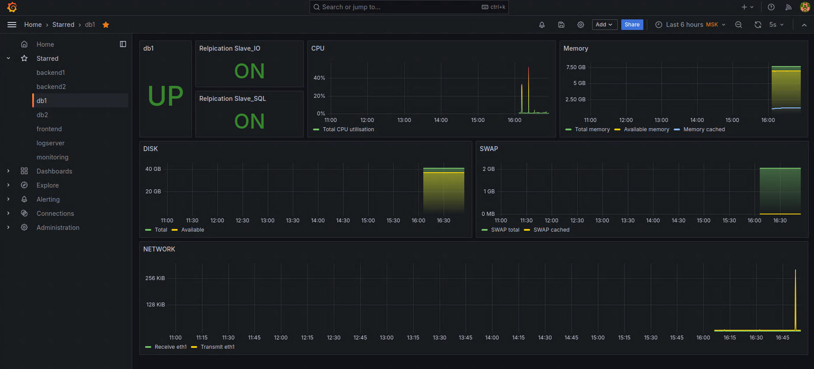
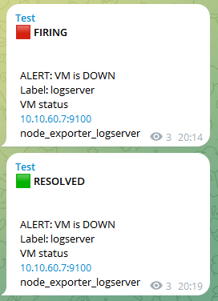
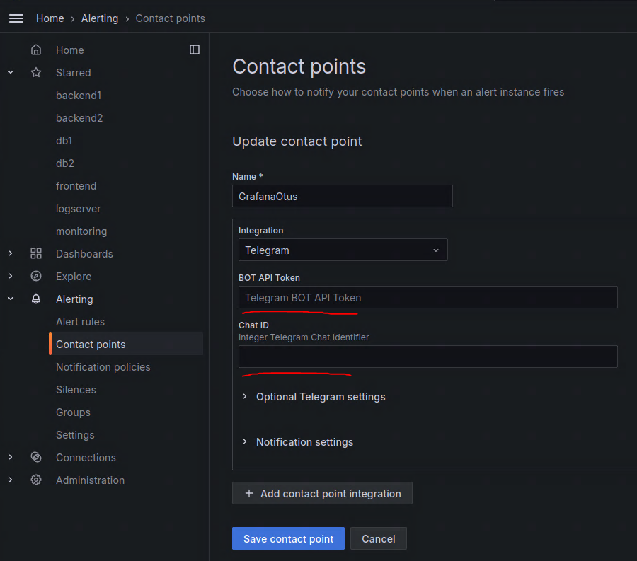

# Финальный проект курса

## Демонстрация работы системы автоматического управления конфигурациями Ansible в рамках стенда с Web сервисом, базой данных и системами мониторинга и логирования.

Стенд состоит из семи виртуальных машин:

- **frontend**	(NGINX Reverse Proxy + Firewall)

- **backend1**	(Apache HTTP Server + WordPress)

- **backend2**	(Apache HTTP Server + WordPress)

- **db1**	(MySQL)

- **db2**	(MySQL)

- **monitor**	(Prometheus + Grafana)

- **logserver**	(Rsyslog + BorgBackup)

Внешняя IP сеть 192.168.63.8/30

Внутренняя IP сеть 10.10.60.0/28

Назначенные IP адреса для виртуальных машин указаны на схеме:

[](Schema.png)


### Описание стенда

Nginx на внешнем IP адресе 192.168.63.10 слушает порты 80 и 443. Входящее соединение на порт 80 перенаправляется на порт 443.

Используется самоподписанный сертификат.

Входящие внешние подключения по другим портам блокинуются firewall.

Далее запрос отправляется на бэкенд серверы. Баленсировка нагрузки осуществляется round-robin спрособом.

Серверы баз данных настроены в режиме Master-Master репликации, а демон Keepalived балансирует подключение к ним со стороны бэкенд серверов. Для подключения к базе данных бэкенд серверы использую виртуальный IP адрес Keepalived.

Каждые 10 минут базы данных снимют бэкап в каталог `/mysql-backup` с ротацией трёх экземпляров. Далее каждые 5 минут эти бэкапы выгружаются в бэкап репозиторий на **logserver**. Для сервера **db1** это `/backups/mysql/db1`, для сервера **db2** - `/backups/mysql/db2`.
Бэкапы в репозиториях храняться за 1 день, а также 12 ежемесячных + один ежегодный.

**logserver** служит также общим коллектором логов со всех серверов. Структура сбора логов представлена ниже:

```bash
/var/log/rsyslog/
├── backend1
│   ├── anacron
│   ├── Apache
│   │   └── example.com-access.log
│   ├── rsyslogd
│   ├── run-parts(
│   ├── sshd
│   ├── systemd
│   └── systemd-logind
├── backend2
│   ├── anacron
│   ├── Apache
│   │   └── example.com-access.log
│   ├── rsyslogd
│   ├── sshd
│   ├── systemd
│   └── systemd-logind
├── db1
│   ├── anacron
│   ├── borgbackup
│   ├── BorgBackup
│   │   └── borgbackup.log
│   ├── mysql-backup.sh
│   ├── rsyslogd
│   ├── run-parts(
│   ├── sshd
│   ├── sudo
│   ├── systemd
│   └── systemd-logind
├── db2
│   ├── anacron
│   ├── borgbackup
│   ├── BorgBackup
│   │   └── borgbackup.log
│   ├── mysql-backup.sh
│   ├── rsyslogd
│   ├── run-parts(
│   ├── sshd
│   ├── systemd
│   └── systemd-logind
├── frontend
│   ├── anacron
│   ├── Nginx
│   │   └── access.log
│   ├── rsyslogd
│   ├── run-parts(
│   ├── sshd
│   ├── systemd
│   └── systemd-logind
└── monitor
    ├── anacron
    ├── grafana
    └── rsyslogd
```

Система мониторинга доступна c хостовой машины по проброшенному порту http://localhost:3000

Dashboard системы мониторинга выглядит следующим образом:

[](Dashboard.png)

Информирование об изменении состояния сервера и статуса репликации отправляется в чат Telegram. Ниже представлен вид сообщений:

[](Telegram.png)

Необходимо указать `BOT API Token` и `Chat ID` в конфигурации Contact point, в полях, представленых на картинке ниже:

[](Contact_point.png)

### Работа со стендом

Для запуска стенда используются следующие переменные:

файл `ansible/install_backend/vars/main.yml`

(изменение этих переменных потребует замены файла `ansible/install_backend/tasks/files/wp-config.php`)

```bash
db_name: "wordpress"
mysql_wordpress_user: wp
mysql_wordpress_user_password: "!OtusLinux2024"
```

файл `ansible/install_backend/vars/main.yml`

```bash
mysql_root_password: "str0ngRootP@ssw0rd!$$"
db_name: "wordpress"
mysql_wordpress_user: wp
mysql_wordpress_user_password: "!OtusLinux2024"
repl_user: "repl"
mysql_repl_user_password: "!OtusLinux2024"
monitor_user: "monitor"
mysql_monitor_user_password: "P1e@seCh@ngeMe"
```

Далее запускаем стенд командой `vagrant up`.

Стенд может продолжать полноценно функционировать при одновременном выходе из строй одной машины бэкенда и одной машины с базой данных.

При необходимости восстановить любую из машин, можно воспользоваться следующими командами:

**frontend**

```bash
$ vagrant up frontend --no-provision
$ ansible-playbook ansible/provision.yml --tags frontend -i ansible/hosts --limit "frontend"
```

**backend1**

```bash
$ vagrant up backend1 --no-provision
$ ansible-playbook ansible/provision.yml --tags backend -i ansible/hosts --limit "backend1"
```

**backend2**

```bash
$ vagrant up backend2 --no-provision
$ ansible-playbook ansible/provision.yml --tags backend -i ansible/hosts --limit "backend2"
```

**db1**

```bash
$ vagrant up db1 --no-provision
$ ansible-playbook ansible/provision.yml --tags db -i ansible/hosts --limit "db1"
```

**db2**

```bash
$ vagrant up db2 --no-provision
$ ansible-playbook ansible/provision.yml --tags db -i ansible/hosts --limit "db2"
```

**monitor**

```bash
$ vagrant up monitor --no-provision
$ ansible-playbook ansible/provision.yml --tags monitor -i ansible/hosts --limit "monitor"
```

**logserver**

```bash
$ vagrant up logserver --no-provision
$ ansible-playbook ansible/provision.yml --tags logserver -i ansible/hosts --limit "logserver"
```