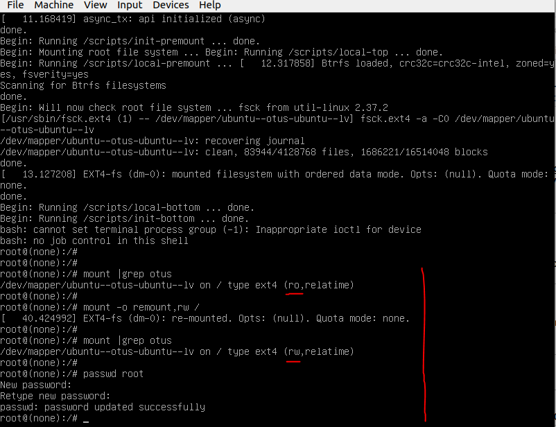

# Задание 9 (Работа с загрузчиком)

Что требуется сделать:

1. Установить систему с LVM, после чего переименовать VG.
2. Включить отображение меню Grub.
3. Попасть в систему без пароля несколькими способами.

=========================================================

Vagrantfile разворачивает виртуальную машину.

Далее на этой виртуальной машине происходит:

- переименование Volume Groupe ***ubuntu-vg*** на ***ubuntu-otus*** (с сохранением конфигурации после перезагрузки)
- включение отображения меню Grub

Лог выполнения указанных операций отображается при разворачивании виртуальной машины командой:

```bash
$ vagrant up
```

### Попасть в систему без пароля несколькими способами

### Способ №1

Перезагружаем виртуальную машину.

Приостанавливаем загрузку виртуальной машины после появления меню загрузчика.

[](Grub.png)

Выделяем Ubuntu и нажимаем `e` для редактирования команд перед запуском системы.

Далее добавляем `init=/bin/bash` для автоматического попадания в bash после загрузки системы.

Продолжаем загрузку системы сочетамием клавишь `Ctrl+x`.

[](init.png)

При этом рутовая файловая система монтируется в режиме Read-Only.

Для изменения режима на Read-Write необходимо дать команду `mount -o remount,rw /`.

При необходимости меняем пароль для пользователя root командой `passwd root`.

[](mount.png)

### Способ №2

Аналогичен первому за исключением того, что можно сразу указать загрузчику смонтировать рутовую файловую систему в режиме Read-Write.

Для этого, при редактировании строки загрузки, указываем параметр `rw init=/bin/bash`.

[](init_rw.png)

[](mount_rw.png)

Оба вышеописанных способа подходят для сброса забытого пароля пользователя root.

### Способ №3 (Recovery mode)

Данный способ подходит для диагностики и восстановления системы. Однако, для доступа в root shell потребуется ввести пароль пользователя root (если он установлен).

- приостанавливаем загрузку виртуальной машины после появления меню загрузчика;
- заходим в раздел **Advanced options for Ubuntu**;
- далее загружаем recovery mode;
- открываем root shell.


[](recovery_mode_root.png)