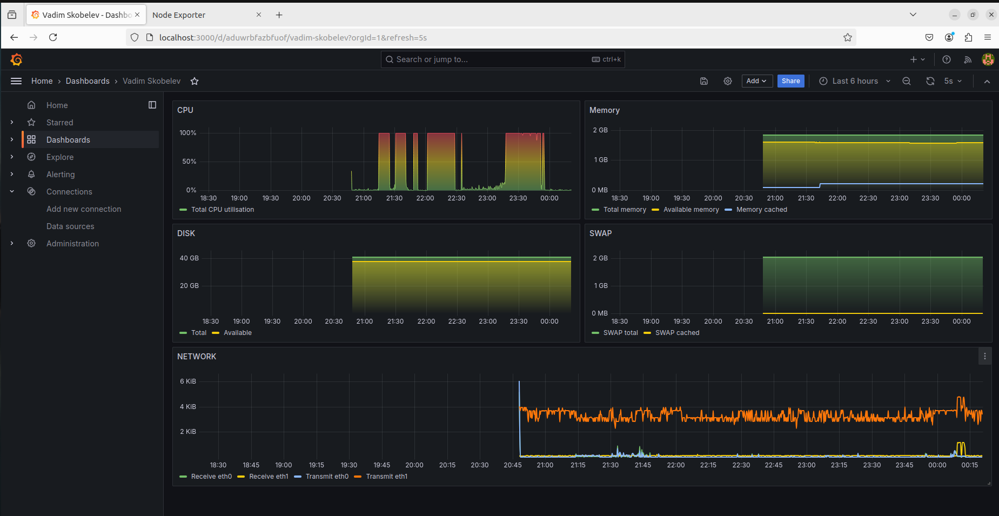

# Задание 15 (Настройка мониторинга)

Для демонстрации используем стенд, состоящий из двух виртуальных машин `server` и `client`.

Стенд разворачивается по команде:

```bash
$ vagrant up
```

Для взаимодействия виртуальных машин используется закрытая сеть:

server - 192.168.50.10

client - 192.168.50.11

На сервере запускается Prometheus + Grafana. На клиенте Node Exporter.

На хостовую виртуальную машину пробрасываются порты:

```
Prometheus      - port 9090
Grafana         - port 3000
Node Exporter   - port 9100
```

Dashboard для Grafana представлен в виде json файла для импорта `Vadim Skobelev-1723756951650.json`.

На Dashboard отображается следующая статистика с виртуальной машины client:

```
CPU utilization
Memory (Total, Avaliable, Cached)
SWAP (Toatal, Cached)
DISK (Total, Avaliable)
Network (Receive/Transmit bytes)
```

[](Dashboard.PNG)