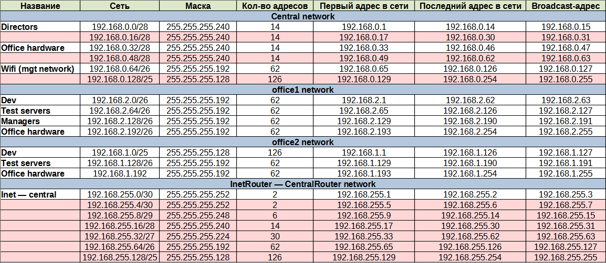

# Задание 19 (Разворачиваем сетевую лабораторию)

Планируемая архитектура

построить следующую архитектуру

    Сеть office1

    192.168.2.0/26 - dev
    192.168.2.64/26 - test servers
    192.168.2.128/26 - managers
    192.168.2.192/26 - office hardware
    
    
    Сеть office2
    192.168.1.0/25 - dev
    192.168.1.128/26 - test servers
    192.168.1.192/26 - office hardware
    
    Сеть central
    192.168.0.0/28 - directors
    192.168.0.32/28 - office hardware
    192.168.0.64/26 - wifi
    
    ```
    Office1 ---\
    ----> Central --IRouter --> internet
    Office2----/
    ```

    Итого должны получится следующие сервера
    
    inetRouter
    centralRouter
    office1Router
    office2Router
    centralServer
    office1Server
    office2Server


## Теоретическая часть

Произведём расчёт подсетей, проверим правильность разбиения и найдём свободные подсети.

[](network_plan.PNG)

## Практическая часть

Необходимо:

- Соединить офисы в сеть согласно схеме и настроить роутинг

- Все сервера и роутеры должны ходить в Интернет черз inetRouter

- Все сервера должны видеть друг друга

- У всех серверов отключить дефолт на нат (eth0), который vagrant поднимает для связи

### Выполнение

Разворачиваем стенд командой `vagrant up` и проверяем результат.

Проверяем доступность сети Интернет с **office1Server**. Видим, что маршрут прохождения пакетов верный:

**office1Server --> office1Router --> centralRouter --> inetRouter**

```bash
root@office1Server:~# ping 8.8.8.8
PING 8.8.8.8 (8.8.8.8) 56(84) bytes of data.
64 bytes from 8.8.8.8: icmp_seq=1 ttl=57 time=254 ms
64 bytes from 8.8.8.8: icmp_seq=2 ttl=57 time=226 ms
^C
--- 8.8.8.8 ping statistics ---
2 packets transmitted, 2 received, 0% packet loss, time 1002ms
rtt min/avg/max/mdev = 226.189/239.908/253.628/13.719 ms
root@office1Server:~# traceroute 8.8.8.8
traceroute to 8.8.8.8 (8.8.8.8), 30 hops max, 60 byte packets
 1  _gateway (192.168.2.129)  3.231 ms  5.476 ms  2.042 ms
 2  192.168.255.9 (192.168.255.9)  8.474 ms  16.537 ms  16.003 ms
 3  192.168.255.1 (192.168.255.1)  21.910 ms  39.460 ms  48.420 ms
 4  _gateway (10.0.2.2)  49.446 ms  54.665 ms  54.528 ms
 5  * * *
 6  * * *
 7  * * *
 8  * * *
...
```

Проверяем доступность серверов между собой на примере **office2Server --> centralServer**.

Маршрут прохождения пакетов верный:

**office2Server --> office2Router --> centralRouter --> centralServer**

```bash
root@office2Server:~# ping 192.168.0.2
PING 192.168.0.2 (192.168.0.2) 56(84) bytes of data.
64 bytes from 192.168.0.2: icmp_seq=1 ttl=62 time=12.6 ms
64 bytes from 192.168.0.2: icmp_seq=2 ttl=62 time=4.66 ms
^C
--- 192.168.0.2 ping statistics ---
2 packets transmitted, 2 received, 0% packet loss, time 1007ms
rtt min/avg/max/mdev = 4.655/8.629/12.604/3.974 ms
root@office2Server:~# traceroute 192.168.0.2
traceroute to 192.168.0.2 (192.168.0.2), 30 hops max, 60 byte packets
 1  _gateway (192.168.1.1)  2.535 ms  2.121 ms  3.012 ms
 2  192.168.255.5 (192.168.255.5)  54.188 ms  54.136 ms  53.324 ms
 3  192.168.0.2 (192.168.0.2)  52.696 ms  63.606 ms  63.090 ms
root@office2Server:~# 
```