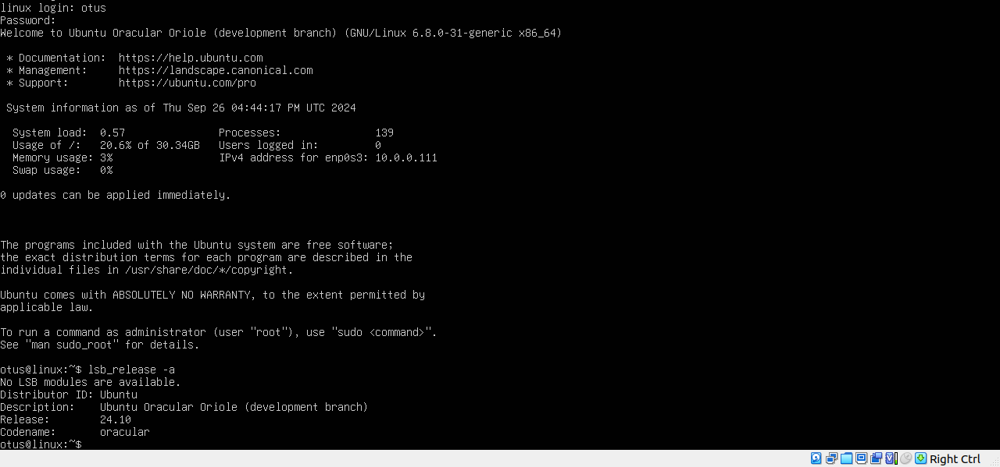

# Задание 20 (Настройка PXE сервера для автоматической установки)

Стенд состоит из двух виртуальных машин `pxeserver` и `pxeclient`.

После выполнения команды `vagrant up` происходит их последовательный запуск. При этом, на виртуальной машине `pxeclient` выполняется установка Ubuntu 24 с виртуальной машины `pxeserver`.

Процесс подготовки `pxeclient` займёт примерно 50 минут.

По окончании установки будет выполнена автоматическая перезагрузка виртуальной машины `pxeclient`. В этот момент её нужно выключить и поменять последовательность загрузки (Boot Order) в настройках виртуальной машины, чтобы загрузка начиналась с жёсткого диска.

После загрузки виртуальной машины мы можем выполнить вход пользователем `otus` с паролем `123`, и проверить версию операционной системы:

