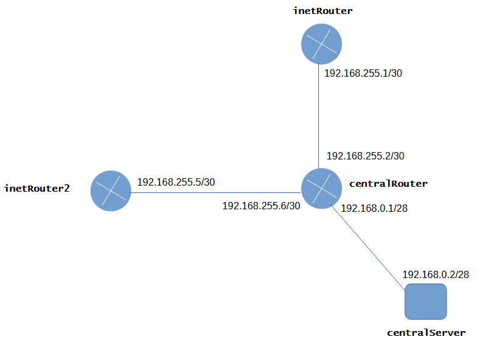
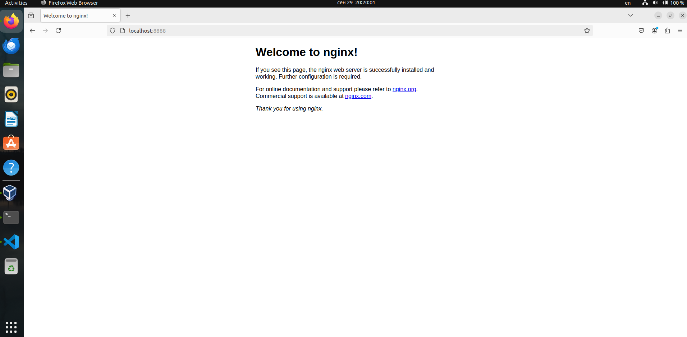

# Задание 21 (Сценарии iptables)

Схема стенда:
    
[](Schema.PNG)

Необходимо:

1. Реализовать Port knocking

    - centralRouter может попасть по ssh на inetRouter через knock.

2. Для inetRouter2 настроить port forwarding на хост.

3. Запустить Nginx на centralServer.

4. Пробросить порт 80  centralServer на порт 8080 inetRouter2.

5. Доступ в Интернет организовать через inetRouter.


Выполняем развёртывание реализованной конфигурации командой `vagrant up`, и проверяем результат.

Доступ в Интернет организован через inetRouter:

```bash
root@centralServer:~# ping 8.8.8.8
PING 8.8.8.8 (8.8.8.8) 56(84) bytes of data.
64 bytes from 8.8.8.8: icmp_seq=1 ttl=59 time=13.5 ms
64 bytes from 8.8.8.8: icmp_seq=2 ttl=59 time=10.5 ms
^C
--- 8.8.8.8 ping statistics ---
2 packets transmitted, 2 received, 0% packet loss, time 1003ms
rtt min/avg/max/mdev = 10.523/12.001/13.479/1.478 ms
root@centralServer:~# traceroute 8.8.8.8
traceroute to 8.8.8.8 (8.8.8.8), 30 hops max, 60 byte packets
 1  _gateway (192.168.0.1)  9.056 ms  10.786 ms  2.190 ms
 2  192.168.255.1 (192.168.255.1)  11.446 ms  13.421 ms  13.348 ms
 3  _gateway (10.0.2.2)  32.763 ms  32.733 ms  32.721 ms
 4  * * *
 5  * * *
 6  * * *
 7  * * *
...
```

Доступ по ssh на inetRouter с centralRouter возможен только с использованием knock:

```bash
root@centralRouter:~# ssh vagrant@192.168.255.1
ssh: connect to host 192.168.255.1 port 22: Connection refused
root@centralRouter:~# knock 192.168.255.1 7222:tcp 8222:udp 9222:tcp
root@centralRouter:~# ssh vagrant@192.168.255.1
The authenticity of host '192.168.255.1 (192.168.255.1)' can't be established.
ED25519 key fingerprint is SHA256:MqXPiijQjlfeKrqcTJI+Z01XAs5PoPOPE15wZYLyqQ8.
This key is not known by any other names
Are you sure you want to continue connecting (yes/no/[fingerprint])? yes
Warning: Permanently added '192.168.255.1' (ED25519) to the list of known hosts.
vagrant@192.168.255.1's password: 
Welcome to Ubuntu 22.04.4 LTS (GNU/Linux 5.15.0-112-generic x86_64)

 * Documentation:  https://help.ubuntu.com
 * Management:     https://landscape.canonical.com
 * Support:        https://ubuntu.com/pro

 System information as of Sun Sep 29 17:04:59 UTC 2024

  System load:  0.59              Processes:               95
  Usage of /:   4.2% of 38.70GB   Users logged in:         0
  Memory usage: 23%               IPv4 address for enp0s3: 10.0.2.15
  Swap usage:   0%


Expanded Security Maintenance for Applications is not enabled.

83 updates can be applied immediately.
48 of these updates are standard security updates.
To see these additional updates run: apt list --upgradable

1 additional security update can be applied with ESM Apps.
Learn more about enabling ESM Apps service at https://ubuntu.com/esm

New release '24.04.1 LTS' available.
Run 'do-release-upgrade' to upgrade to it.


Last login: Sun Sep 29 17:14:35 2024 from 10.0.2.2
vagrant@inetRouter:~$ 
```

Доступ к Nginx на centralServer с хоста через проброс портов:

Запрос проходит цепочку ***Host port 8888 <---> inetRouter2 port 8080 <---> centralServer port 80***

[](nginx_check.PNG)
