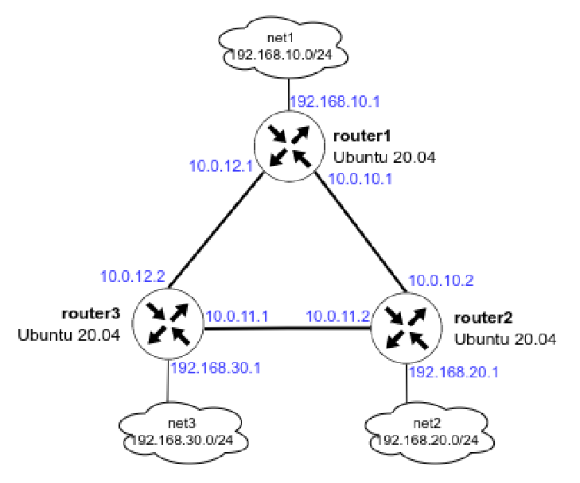

# Задание 22 (OSPF)

Схема стенда:
    
[](Schema.PNG)

Необходимо:

    1. Поднять три виртуальные машины

    2. Объединить их разными vlan

      - поднять OSPF между машинами на базе Quagga;

      - изобразить ассиметричный роутинг;

      - сделать один из линков "дорогим", но что бы при этом роутинг был симметричным.

Поднимаем стенд командой `vagrant up` и проверем результат.

Проверим доступность сетей с хоста **router1**:

```bash
root@router1:~# ping 192.168.20.1
PING 192.168.20.1 (192.168.20.1) 56(84) bytes of data.
64 bytes from 192.168.20.1: icmp_seq=1 ttl=64 time=2.89 ms
64 bytes from 192.168.20.1: icmp_seq=2 ttl=64 time=1.35 ms
64 bytes from 192.168.20.1: icmp_seq=3 ttl=64 time=1.52 ms
64 bytes from 192.168.20.1: icmp_seq=4 ttl=64 time=2.15 ms
^C
--- 192.168.20.1 ping statistics ---
4 packets transmitted, 4 received, 0% packet loss, time 3006ms
rtt min/avg/max/mdev = 1.349/1.978/2.893/0.606 ms
root@router1:~# traceroute 192.168.20.1
traceroute to 192.168.20.1 (192.168.20.1), 30 hops max, 60 byte packets
 1  192.168.20.1 (192.168.20.1)  2.119 ms  3.537 ms  2.274 ms
root@router1:~# ping 192.168.30.1
PING 192.168.30.1 (192.168.30.1) 56(84) bytes of data.
64 bytes from 192.168.30.1: icmp_seq=1 ttl=64 time=1.91 ms
64 bytes from 192.168.30.1: icmp_seq=2 ttl=64 time=2.20 ms
64 bytes from 192.168.30.1: icmp_seq=3 ttl=64 time=2.26 ms
^C
--- 192.168.30.1 ping statistics ---
3 packets transmitted, 3 received, 0% packet loss, time 2003ms
rtt min/avg/max/mdev = 1.911/2.123/2.256/0.151 ms
root@router1:~# traceroute 192.168.30.1
traceroute to 192.168.30.1 (192.168.30.1), 30 hops max, 60 byte packets
 1  192.168.30.1 (192.168.30.1)  1.762 ms  1.343 ms  1.211 ms
root@router1:~# 
```

При отключении линка между **router1** и **router3** маршрут изменится, и пойдёт через **router2**:

```bash
root@router1:~# ifconfig enp0s9 down
root@router1:~# ip a | grep enp0s9
4: enp0s9: <BROADCAST,MULTICAST> mtu 1500 qdisc fq_codel state DOWN group default qlen 1000
root@router1:~# ping 192.168.30.1
PING 192.168.30.1 (192.168.30.1) 56(84) bytes of data.
64 bytes from 192.168.30.1: icmp_seq=1 ttl=63 time=6.01 ms
64 bytes from 192.168.30.1: icmp_seq=2 ttl=63 time=3.12 ms
^C
--- 192.168.30.1 ping statistics ---
2 packets transmitted, 2 received, 0% packet loss, time 1014ms
rtt min/avg/max/mdev = 3.124/4.566/6.008/1.442 ms
root@router1:~# traceroute 192.168.30.1
traceroute to 192.168.30.1 (192.168.30.1), 30 hops max, 60 byte packets
 1  10.0.10.2 (10.0.10.2)  1.673 ms  1.496 ms  4.597 ms
 2  192.168.30.1 (192.168.30.1)  10.665 ms  10.238 ms  10.125 ms
root@router1:~# vtysh

Hello, this is FRRouting (version 10.1.1).
Copyright 1996-2005 Kunihiro Ishiguro, et al.

router1# show ip route ospf
Codes: K - kernel route, C - connected, L - local, S - static,
       R - RIP, O - OSPF, I - IS-IS, B - BGP, E - EIGRP, N - NHRP,
       T - Table, v - VNC, V - VNC-Direct, A - Babel, F - PBR,
       f - OpenFabric, t - Table-Direct,
       > - selected route, * - FIB route, q - queued, r - rejected, b - backup
       t - trapped, o - offload failure

O   10.0.10.0/30 [110/100] is directly connected, enp0s8, weight 1, 00:47:38
O>* 10.0.11.0/30 [110/200] via 10.0.10.2, enp0s8, weight 1, 00:03:21
O>* 10.0.12.0/30 [110/300] via 10.0.10.2, enp0s8, weight 1, 00:03:21
O   192.168.10.0/24 [110/100] is directly connected, enp0s10, weight 1, 00:48:09
O>* 192.168.20.0/24 [110/200] via 10.0.10.2, enp0s8, weight 1, 00:47:34
O>* 192.168.30.0/24 [110/300] via 10.0.10.2, enp0s8, weight 1, 00:03:21
router1# 
```

Для демонстрации ассиметричного роутинга, возвращаем линк между **router1** и **router3** (поднимаем интерфейс `enp0s9` на **router1**),

а также поменяем стоимость интерфейса `enp0s8` на **router1**:

```bash
root@router1:~# vtysh

Hello, this is FRRouting (version 10.1.1).
Copyright 1996-2005 Kunihiro Ishiguro, et al.

router1# conf t
router1(config)# int enp0s8
router1(config-if)# ip ospf cost 1000
router1(config-if)# exit
router1(config)# exit
router1# show ip route ospf
Codes: K - kernel route, C - connected, L - local, S - static,
       R - RIP, O - OSPF, I - IS-IS, B - BGP, E - EIGRP, N - NHRP,
       T - Table, v - VNC, V - VNC-Direct, A - Babel, F - PBR,
       f - OpenFabric, t - Table-Direct,
       > - selected route, * - FIB route, q - queued, r - rejected, b - backup
       t - trapped, o - offload failure

O   10.0.10.0/30 [110/300] via 10.0.12.2, enp0s9, weight 1, 00:00:15
O>* 10.0.11.0/30 [110/200] via 10.0.12.2, enp0s9, weight 1, 00:00:15
O   10.0.12.0/30 [110/100] is directly connected, enp0s9, weight 1, 00:03:36
O   192.168.10.0/24 [110/100] is directly connected, enp0s10, weight 1, 00:04:07
O>* 192.168.20.0/24 [110/300] via 10.0.12.2, enp0s9, weight 1, 00:00:15
O>* 192.168.30.0/24 [110/200] via 10.0.12.2, enp0s9, weight 1, 00:03:26
router1# 
```

```bash
root@router2:~# vtysh

Hello, this is FRRouting (version 10.1.1).
Copyright 1996-2005 Kunihiro Ishiguro, et al.

router2# show ip route ospf
Codes: K - kernel route, C - connected, L - local, S - static,
       R - RIP, O - OSPF, I - IS-IS, B - BGP, E - EIGRP, N - NHRP,
       T - Table, v - VNC, V - VNC-Direct, A - Babel, F - PBR,
       f - OpenFabric, t - Table-Direct,
       > - selected route, * - FIB route, q - queued, r - rejected, b - backup
       t - trapped, o - offload failure

O   10.0.10.0/30 [110/100] is directly connected, enp0s8, weight 1, 00:06:05
O   10.0.11.0/30 [110/100] is directly connected, enp0s9, weight 1, 00:06:05
O>* 10.0.12.0/30 [110/200] via 10.0.10.1, enp0s8, weight 1, 00:05:25
  *                        via 10.0.11.1, enp0s9, weight 1, 00:05:25
O>* 192.168.10.0/24 [110/200] via 10.0.10.1, enp0s8, weight 1, 00:05:25
O   192.168.20.0/24 [110/100] is directly connected, enp0s10, weight 1, 00:06:05
O>* 192.168.30.0/24 [110/200] via 10.0.11.1, enp0s9, weight 1, 00:05:30
router2# 
```

Видим, что маршрут от **router1** до сети 192.168.20.0/30 теперь пойдёт через **router3**, но обратный трафик от
**router2** пойдёт напрямую.

Дополнительно проверим:

На **router1** запустим пинг от 192.168.10.1 до 192.168.20.1, а на **router2** запустим tcpdump на портах `enp0s9` и `enp0s8`:

```bash
root@router1:~# ping -I 192.168.10.1 192.168.20.1
PING 192.168.20.1 (192.168.20.1) from 192.168.10.1 : 56(84) bytes of data.
64 bytes from 192.168.20.1: icmp_seq=1 ttl=64 time=13.6 ms
64 bytes from 192.168.20.1: icmp_seq=2 ttl=64 time=2.31 ms
64 bytes from 192.168.20.1: icmp_seq=3 ttl=64 time=2.19 ms
64 bytes from 192.168.20.1: icmp_seq=4 ttl=64 time=3.15 ms
^C
--- 192.168.20.1 ping statistics ---
4 packets transmitted, 4 received, 0% packet loss, time 3004ms
rtt min/avg/max/mdev = 2.192/5.310/13.591/4.794 ms
root@router1:~# 
```

```bash
root@router2:~# tcpdump -i enp0s9
tcpdump: verbose output suppressed, use -v or -vv for full protocol decode
listening on enp0s9, link-type EN10MB (Ethernet), capture size 262144 bytes
11:25:10.888471 IP 192.168.10.1 > router2: ICMP echo request, id 2, seq 1, length 64
11:25:11.887383 IP 192.168.10.1 > router2: ICMP echo request, id 2, seq 2, length 64
11:25:12.888625 IP 192.168.10.1 > router2: ICMP echo request, id 2, seq 3, length 64
11:25:13.890098 IP 192.168.10.1 > router2: ICMP echo request, id 2, seq 4, length 64
^C
4 packets captured
4 packets received by filter
0 packets dropped by kernel
root@router2:~# 
```

```bash
root@router2:~# tcpdump -i enp0s8
tcpdump: verbose output suppressed, use -v or -vv for full protocol decode
listening on enp0s8, link-type EN10MB (Ethernet), capture size 262144 bytes
11:25:10.888621 IP router2 > 192.168.10.1: ICMP echo reply, id 2, seq 1, length 64
11:25:11.887449 IP router2 > 192.168.10.1: ICMP echo reply, id 2, seq 2, length 64
11:25:12.888682 IP router2 > 192.168.10.1: ICMP echo reply, id 2, seq 3, length 64
11:25:13.890292 IP router2 > 192.168.10.1: ICMP echo reply, id 2, seq 4, length 64
11:25:16.042698 ARP, Request who-has 10.0.10.1 tell router2, length 28
11:25:16.047170 ARP, Reply 10.0.10.1 is-at 08:00:27:59:56:c0 (oui Unknown), length 46
^C
6 packets captured
6 packets received by filter
0 packets dropped by kernel
root@router2:~# 
```

Видим, что ICMP запросы на адрес 192.168.20.1 приходят через интерфейс `enp0s9`, а ответы уходят на интерфейс `enp0s8`.

Ассиметричный роутинг настроен.

Чтобы сделать роутинг симметричным, аналогично поменяем стоимость интерфейса `enp0s8` на **router2**:

```bash
root@router2:~# vtysh

Hello, this is FRRouting (version 10.1.1).
Copyright 1996-2005 Kunihiro Ishiguro, et al.

router2# conf t
router2(config)# int enp0s8
router2(config-if)# ip ospf cost 1000
router2(config-if)# exit
router2(config)# exit
router2# show ip route ospf
Codes: K - kernel route, C - connected, L - local, S - static,
       R - RIP, O - OSPF, I - IS-IS, B - BGP, E - EIGRP, N - NHRP,
       T - Table, v - VNC, V - VNC-Direct, A - Babel, F - PBR,
       f - OpenFabric, t - Table-Direct,
       > - selected route, * - FIB route, q - queued, r - rejected, b - backup
       t - trapped, o - offload failure

O   10.0.10.0/30 [110/1000] is directly connected, enp0s8, weight 1, 00:00:13
O   10.0.11.0/30 [110/100] is directly connected, enp0s9, weight 1, 00:29:09
O>* 10.0.12.0/30 [110/200] via 10.0.11.1, enp0s9, weight 1, 00:00:13
O>* 192.168.10.0/24 [110/300] via 10.0.11.1, enp0s9, weight 1, 00:00:13
O   192.168.20.0/24 [110/100] is directly connected, enp0s10, weight 1, 00:29:09
O>* 192.168.30.0/24 [110/200] via 10.0.11.1, enp0s9, weight 1, 00:28:34
router2# 
```

Для проверки результата повторим пинг с **router1** 192.168.10.1 до 192.168.20.1, а на **router2**, и посмотрим tcpdump на интерфейсе `enp0s9` **router2**:

```bash
root@router1:~# ping -I 192.168.10.1 192.168.20.1
PING 192.168.20.1 (192.168.20.1) from 192.168.10.1 : 56(84) bytes of data.
64 bytes from 192.168.20.1: icmp_seq=1 ttl=63 time=6.28 ms
64 bytes from 192.168.20.1: icmp_seq=2 ttl=63 time=3.54 ms
64 bytes from 192.168.20.1: icmp_seq=3 ttl=63 time=6.09 ms
^C
--- 192.168.20.1 ping statistics ---
3 packets transmitted, 3 received, 0% packet loss, time 2003ms
rtt min/avg/max/mdev = 3.535/5.301/6.283/1.251 ms
root@router1:~# 
```

```bash
root@router2:~# tcpdump -i enp0s9
tcpdump: verbose output suppressed, use -v or -vv for full protocol decode
listening on enp0s9, link-type EN10MB (Ethernet), capture size 262144 bytes
11:45:00.750522 IP 192.168.10.1 > router2: ICMP echo request, id 4, seq 1, length 64
11:45:00.750708 IP router2 > 192.168.10.1: ICMP echo reply, id 4, seq 1, length 64
11:45:01.750822 IP 192.168.10.1 > router2: ICMP echo request, id 4, seq 2, length 64
11:45:01.750914 IP router2 > 192.168.10.1: ICMP echo reply, id 4, seq 2, length 64
11:45:02.751816 IP 192.168.10.1 > router2: ICMP echo request, id 4, seq 3, length 64
11:45:02.751952 IP router2 > 192.168.10.1: ICMP echo reply, id 4, seq 3, length 64
^C
6 packets captured
7 packets received by filter
0 packets dropped by kernel
root@router2:~# 
```

Видим, что теперь ICMP запросы и ответы проходят через интерфейс `enp0s9`.