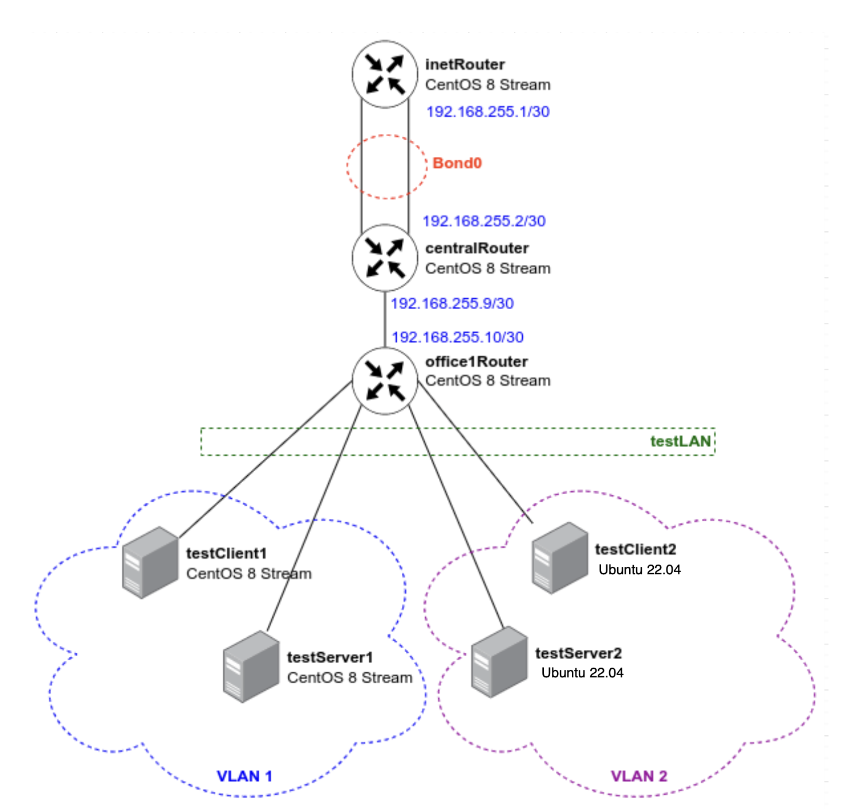

# Задание 25 (Строим бонды и вланы)

Схема стенда состоит из семи виртуальных машин:
    
[](Schema.PNG)

В Office1 в тестовой подсети появляются серверы с доп. интерфейсами и адресами:

- testClient1 - 10.10.10.254
 
- testClient2 - 10.10.10.254
 
- testServer1 - 10.10.10.1
 
- testServer2 - 10.10.10.1

 
Необходимо:

1. Развести вланами **testClient1 <-> testServer1** и **testClient2 <-> testServer2**

2. Между centralRouter и inetRouter "пробросить" 2 линка (общая internal сеть) и объединить их в бонд; проверить работу с отключением интерфейсов.

Требуемая конфигурация реализует при провиженинге.

После разворачивания стенда командой `vagrant up`, проверяем результат:

Так как запуск семи виртуальных машин очень трудоёмкий процесс для компьютера, целесообразно запускать каждую машину вручную:

```bash
$ vagrant up inetRouter
$ vagrant up centralRouter
$ vagrant up office1Router
$ vagrant up testClient1
$ vagrant up testClient2
$ vagrant up testServer1
$ vagrant up testServer2
```

после `vagrant up testServer2` запуститься провиженинг для всех виртуальных машин.


vlan1 (**testClient1 <-> testServer1**):

```bash
[root@testClient1 ~]# ping -c 4 10.10.10.1
PING 10.10.10.1 (10.10.10.1) 56(84) bytes of data.
64 bytes from 10.10.10.1: icmp_seq=1 ttl=64 time=15.6 ms
64 bytes from 10.10.10.1: icmp_seq=2 ttl=64 time=3.24 ms
64 bytes from 10.10.10.1: icmp_seq=3 ttl=64 time=2.84 ms
64 bytes from 10.10.10.1: icmp_seq=4 ttl=64 time=2.99 ms

--- 10.10.10.1 ping statistics ---
4 packets transmitted, 4 received, 0% packet loss, time 3022ms
rtt min/avg/max/mdev = 2.839/6.175/15.623/5.456 ms
[root@testClient1 ~]# 
[root@testClient1 ~]# ip a
1: lo: <LOOPBACK,UP,LOWER_UP> mtu 65536 qdisc noqueue state UNKNOWN group default qlen 1000
    link/loopback 00:00:00:00:00:00 brd 00:00:00:00:00:00
    inet 127.0.0.1/8 scope host lo
       valid_lft forever preferred_lft forever
    inet6 ::1/128 scope host 
       valid_lft forever preferred_lft forever
2: eth0: <BROADCAST,MULTICAST,UP,LOWER_UP> mtu 1500 qdisc fq_codel state UP group default qlen 1000
    link/ether 52:54:00:d3:81:c4 brd ff:ff:ff:ff:ff:ff
    altname enp0s3
    inet 10.0.2.15/24 brd 10.0.2.255 scope global dynamic noprefixroute eth0
       valid_lft 85229sec preferred_lft 85229sec
    inet6 fe80::5054:ff:fed3:81c4/64 scope link 
       valid_lft forever preferred_lft forever
3: eth1: <BROADCAST,MULTICAST,UP,LOWER_UP> mtu 1500 qdisc fq_codel state UP group default qlen 1000
    link/ether 08:00:27:29:55:be brd ff:ff:ff:ff:ff:ff
    altname enp0s8
    inet6 fe80::9dc1:39f1:ee84:78c7/64 scope link noprefixroute 
       valid_lft forever preferred_lft forever
4: eth2: <BROADCAST,MULTICAST,UP,LOWER_UP> mtu 1500 qdisc fq_codel state UP group default qlen 1000
    link/ether 08:00:27:9b:3c:d0 brd ff:ff:ff:ff:ff:ff
    altname enp0s19
    inet 192.168.56.21/24 brd 192.168.56.255 scope global noprefixroute eth2
       valid_lft forever preferred_lft forever
    inet6 fe80::a00:27ff:fe9b:3cd0/64 scope link 
       valid_lft forever preferred_lft forever
5: eth1.1@eth1: <BROADCAST,MULTICAST,UP,LOWER_UP> mtu 1500 qdisc noqueue state UP group default qlen 1000
    link/ether 08:00:27:29:55:be brd ff:ff:ff:ff:ff:ff
    inet 10.10.10.254/24 brd 10.10.10.255 scope global noprefixroute eth1.1
       valid_lft forever preferred_lft forever
    inet6 fe80::a00:27ff:fe29:55be/64 scope link 
       valid_lft forever preferred_lft forever
[root@testClient1 ~]# 
```

vlan2 (**testClient2 <-> testServer2**):

```bash
root@testClient2:~# ping -c 4 10.10.10.1
PING 10.10.10.1 (10.10.10.1) 56(84) bytes of data.
64 bytes from 10.10.10.1: icmp_seq=1 ttl=64 time=18.2 ms
64 bytes from 10.10.10.1: icmp_seq=2 ttl=64 time=6.86 ms
64 bytes from 10.10.10.1: icmp_seq=3 ttl=64 time=10.3 ms
64 bytes from 10.10.10.1: icmp_seq=4 ttl=64 time=2.89 ms

--- 10.10.10.1 ping statistics ---
4 packets transmitted, 4 received, 0% packet loss, time 3845ms
rtt min/avg/max/mdev = 2.894/9.556/18.171/5.622 ms
root@testClient2:~# 
root@testClient2:~# ip a
1: lo: <LOOPBACK,UP,LOWER_UP> mtu 65536 qdisc noqueue state UNKNOWN group default qlen 1000
    link/loopback 00:00:00:00:00:00 brd 00:00:00:00:00:00
    inet 127.0.0.1/8 scope host lo
       valid_lft forever preferred_lft forever
    inet6 ::1/128 scope host 
       valid_lft forever preferred_lft forever
2: enp0s3: <BROADCAST,MULTICAST,UP,LOWER_UP> mtu 1500 qdisc fq_codel state UP group default qlen 1000
    link/ether 02:f4:dd:e3:4b:26 brd ff:ff:ff:ff:ff:ff
    inet 10.0.2.15/24 metric 100 brd 10.0.2.255 scope global dynamic enp0s3
       valid_lft 85224sec preferred_lft 85224sec
    inet6 fe80::f4:ddff:fee3:4b26/64 scope link 
       valid_lft forever preferred_lft forever
3: enp0s8: <BROADCAST,MULTICAST,UP,LOWER_UP> mtu 1500 qdisc fq_codel state UP group default qlen 1000
    link/ether 08:00:27:72:b2:8a brd ff:ff:ff:ff:ff:ff
    inet6 fe80::a00:27ff:fe72:b28a/64 scope link 
       valid_lft forever preferred_lft forever
4: enp0s19: <BROADCAST,MULTICAST,UP,LOWER_UP> mtu 1500 qdisc fq_codel state UP group default qlen 1000
    link/ether 08:00:27:c8:61:f2 brd ff:ff:ff:ff:ff:ff
    inet 192.168.56.31/24 brd 192.168.56.255 scope global enp0s19
       valid_lft forever preferred_lft forever
    inet6 fe80::a00:27ff:fec8:61f2/64 scope link 
       valid_lft forever preferred_lft forever
5: vlan2@enp0s8: <BROADCAST,MULTICAST,UP,LOWER_UP> mtu 1500 qdisc noqueue state UP group default qlen 1000
    link/ether 08:00:27:72:b2:8a brd ff:ff:ff:ff:ff:ff
    inet 10.10.10.254/24 brd 10.10.10.255 scope global vlan2
       valid_lft forever preferred_lft forever
    inet6 fe80::a00:27ff:fe72:b28a/64 scope link 
       valid_lft forever preferred_lft forever
root@testClient2:~# 
```

bond0

Запускаем с **inetRouter** пинг до **centralRouter**, и не останавливая пинг отключаем один из интерфейсов на **centralRouter**. Видим, что пинг не прерывается.

```bash
[root@centralRouter ~]# ip a |grep bond0
3: bond0: <BROADCAST,MULTICAST,MASTER,UP,LOWER_UP> mtu 1500 qdisc noqueue state UP group default qlen 1000
    inet 192.168.255.2/30 brd 192.168.255.3 scope global noprefixroute bond0
4: eth1: <BROADCAST,MULTICAST,SLAVE,UP,LOWER_UP> mtu 1500 qdisc fq_codel master bond0 state UP group default qlen 1000
5: eth2: <BROADCAST,MULTICAST,SLAVE,UP,LOWER_UP> mtu 1500 qdisc fq_codel master bond0 state UP group default qlen 1000
[root@centralRouter ~]# 
[root@centralRouter ~]# ip link set down eth1
[root@centralRouter ~]# 
[root@centralRouter ~]# ip a |grep bond0
3: bond0: <BROADCAST,MULTICAST,MASTER,UP,LOWER_UP> mtu 1500 qdisc noqueue state UP group default qlen 1000
    inet 192.168.255.2/30 brd 192.168.255.3 scope global noprefixroute bond0
4: eth1: <BROADCAST,MULTICAST,SLAVE> mtu 1500 qdisc fq_codel master bond0 state DOWN group default qlen 1000
5: eth2: <BROADCAST,MULTICAST,SLAVE,UP,LOWER_UP> mtu 1500 qdisc fq_codel master bond0 state UP group default qlen 1000
[root@centralRouter ~]# 
[root@centralRouter ~]# ip link set up eth1
[root@centralRouter ~]# ip link set down eth2
[root@centralRouter ~]# ip a |grep bond0
3: bond0: <BROADCAST,MULTICAST,MASTER,UP,LOWER_UP> mtu 1500 qdisc noqueue state UP group default qlen 1000
    inet 192.168.255.2/30 brd 192.168.255.3 scope global noprefixroute bond0
4: eth1: <BROADCAST,MULTICAST,SLAVE,UP,LOWER_UP> mtu 1500 qdisc fq_codel master bond0 state UP group default qlen 1000
5: eth2: <BROADCAST,MULTICAST,SLAVE> mtu 1500 qdisc fq_codel master bond0 state DOWN group default qlen 1000
[root@centralRouter ~]# ip link set up eth2
[root@centralRouter ~]# ip a |grep bond0
3: bond0: <BROADCAST,MULTICAST,MASTER,UP,LOWER_UP> mtu 1500 qdisc noqueue state UP group default qlen 1000
    inet 192.168.255.2/30 brd 192.168.255.3 scope global noprefixroute bond0
4: eth1: <BROADCAST,MULTICAST,SLAVE,UP,LOWER_UP> mtu 1500 qdisc fq_codel master bond0 state UP group default qlen 1000
5: eth2: <BROADCAST,MULTICAST,SLAVE,UP,LOWER_UP> mtu 1500 qdisc fq_codel master bond0 state UP group default qlen 1000
[root@centralRouter ~]# 
```

```bash
[root@inetRouter ~]# ping 192.168.255.2
PING 192.168.255.2 (192.168.255.2) 56(84) bytes of data.
64 bytes from 192.168.255.2: icmp_seq=1 ttl=64 time=21.5 ms
64 bytes from 192.168.255.2: icmp_seq=2 ttl=64 time=4.85 ms
64 bytes from 192.168.255.2: icmp_seq=3 ttl=64 time=2.37 ms
64 bytes from 192.168.255.2: icmp_seq=4 ttl=64 time=5.15 ms
64 bytes from 192.168.255.2: icmp_seq=5 ttl=64 time=2.60 ms
64 bytes from 192.168.255.2: icmp_seq=6 ttl=64 time=2.96 ms
64 bytes from 192.168.255.2: icmp_seq=7 ttl=64 time=6.07 ms
64 bytes from 192.168.255.2: icmp_seq=8 ttl=64 time=4.53 ms
64 bytes from 192.168.255.2: icmp_seq=9 ttl=64 time=5.28 ms
64 bytes from 192.168.255.2: icmp_seq=10 ttl=64 time=32.3 ms
64 bytes from 192.168.255.2: icmp_seq=11 ttl=64 time=2.97 ms
64 bytes from 192.168.255.2: icmp_seq=12 ttl=64 time=2.43 ms
64 bytes from 192.168.255.2: icmp_seq=13 ttl=64 time=6.08 ms
64 bytes from 192.168.255.2: icmp_seq=14 ttl=64 time=1.85 ms
64 bytes from 192.168.255.2: icmp_seq=15 ttl=64 time=2.85 ms
64 bytes from 192.168.255.2: icmp_seq=16 ttl=64 time=2.24 ms
64 bytes from 192.168.255.2: icmp_seq=17 ttl=64 time=2.50 ms
64 bytes from 192.168.255.2: icmp_seq=18 ttl=64 time=1.78 ms
64 bytes from 192.168.255.2: icmp_seq=19 ttl=64 time=6.14 ms
64 bytes from 192.168.255.2: icmp_seq=20 ttl=64 time=2.67 ms
64 bytes from 192.168.255.2: icmp_seq=21 ttl=64 time=2.25 ms
64 bytes from 192.168.255.2: icmp_seq=22 ttl=64 time=3.88 ms
64 bytes from 192.168.255.2: icmp_seq=23 ttl=64 time=2.63 ms
64 bytes from 192.168.255.2: icmp_seq=24 ttl=64 time=9.19 ms
64 bytes from 192.168.255.2: icmp_seq=25 ttl=64 time=2.24 ms
64 bytes from 192.168.255.2: icmp_seq=26 ttl=64 time=2.12 ms
64 bytes from 192.168.255.2: icmp_seq=27 ttl=64 time=5.21 ms
64 bytes from 192.168.255.2: icmp_seq=28 ttl=64 time=17.5 ms
64 bytes from 192.168.255.2: icmp_seq=29 ttl=64 time=11.4 ms
64 bytes from 192.168.255.2: icmp_seq=30 ttl=64 time=3.08 ms
64 bytes from 192.168.255.2: icmp_seq=31 ttl=64 time=8.41 ms
64 bytes from 192.168.255.2: icmp_seq=32 ttl=64 time=10.7 ms
64 bytes from 192.168.255.2: icmp_seq=33 ttl=64 time=1.68 ms
64 bytes from 192.168.255.2: icmp_seq=34 ttl=64 time=3.92 ms
64 bytes from 192.168.255.2: icmp_seq=35 ttl=64 time=2.34 ms
64 bytes from 192.168.255.2: icmp_seq=36 ttl=64 time=4.43 ms
64 bytes from 192.168.255.2: icmp_seq=37 ttl=64 time=2.69 ms
64 bytes from 192.168.255.2: icmp_seq=38 ttl=64 time=2.54 ms
64 bytes from 192.168.255.2: icmp_seq=39 ttl=64 time=1.91 ms
64 bytes from 192.168.255.2: icmp_seq=40 ttl=64 time=3.93 ms
64 bytes from 192.168.255.2: icmp_seq=41 ttl=64 time=8.67 ms
64 bytes from 192.168.255.2: icmp_seq=42 ttl=64 time=2.07 ms
64 bytes from 192.168.255.2: icmp_seq=43 ttl=64 time=2.37 ms
64 bytes from 192.168.255.2: icmp_seq=44 ttl=64 time=3.41 ms
64 bytes from 192.168.255.2: icmp_seq=45 ttl=64 time=3.29 ms
64 bytes from 192.168.255.2: icmp_seq=46 ttl=64 time=2.14 ms
64 bytes from 192.168.255.2: icmp_seq=47 ttl=64 time=2.41 ms
64 bytes from 192.168.255.2: icmp_seq=48 ttl=64 time=3.03 ms
64 bytes from 192.168.255.2: icmp_seq=49 ttl=64 time=2.38 ms
64 bytes from 192.168.255.2: icmp_seq=50 ttl=64 time=2.74 ms
64 bytes from 192.168.255.2: icmp_seq=51 ttl=64 time=25.3 ms
64 bytes from 192.168.255.2: icmp_seq=52 ttl=64 time=2.07 ms
64 bytes from 192.168.255.2: icmp_seq=53 ttl=64 time=3.79 ms
64 bytes from 192.168.255.2: icmp_seq=54 ttl=64 time=3.07 ms
64 bytes from 192.168.255.2: icmp_seq=55 ttl=64 time=4.15 ms
^C
--- 192.168.255.2 ping statistics ---
55 packets transmitted, 55 received, 0% packet loss, time 54231ms
rtt min/avg/max/mdev = 1.683/5.308/32.335/5.900 ms
[root@inetRouter ~]# 
```