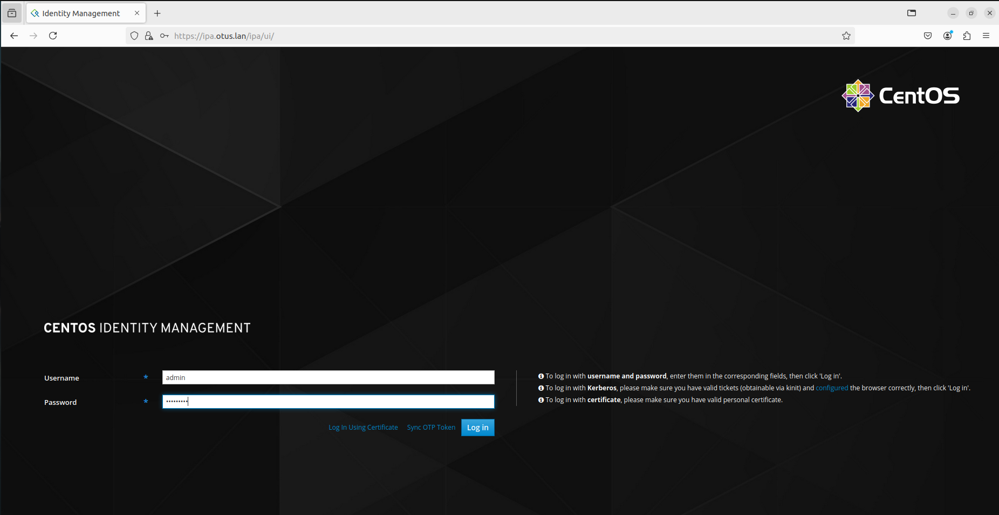
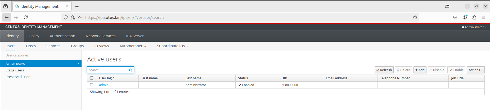
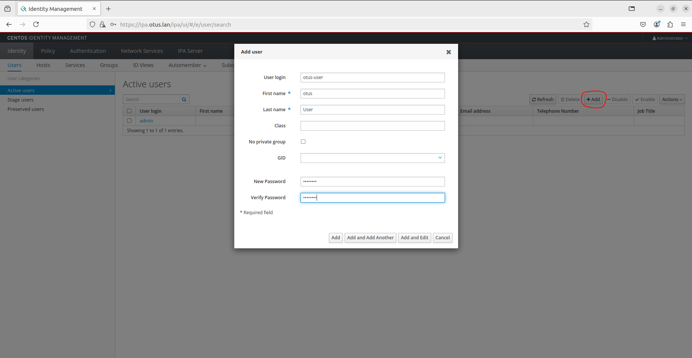

# Задание 26 (LDAP)

Стенд демонстрирует установку и использования FreeIPA в качестве LDAP сервера.

После выполнения команды `vagrant up` мы имеем три виртуальные машины:

**ipa.otus.lan** - server

**client1.otus.lan** - Client1

**client2.otus.lan** - Client2

Добавим запись `192.168.57.10	ipa.otus.lan` в `/etc/hosts` на хостовой машине, и проверим возможность подключиться к серверу `https://ipa.otus.lan`:

(в стенде для доступа используется логин и пароль `admin/admin1234`)

[](ipa_1.PNG)

[](ipa_2.PNG)


Далее в WebUI добавляем тестового пользователя `otus-user`:

[](otus-user.PNG)

Проверим созданного пользователя, осуществив первый вход и смену пароля с **client1**:

```bash
[root@client1 ~]# kinit otus-user
Password for otus-user@OTUS.LAN: 
Password expired.  You must change it now.
Enter new password: 
Enter it again: 
[root@client1 ~]# 
```

Также проверим получение билета с **client2** 

(выведем список кэшированных билетов Kerberos):

```bash
[root@client2 ~]# kinit otus-user
Password for otus-user@OTUS.LAN: 
[root@client2 ~]# klist
Ticket cache: KCM:0
Default principal: otus-user@OTUS.LAN

Valid starting     Expires            Service principal
10/20/24 22:54:41  10/21/24 22:18:58  krbtgt/OTUS.LAN@OTUS.LAN
[root@client2 ~]# 
```

