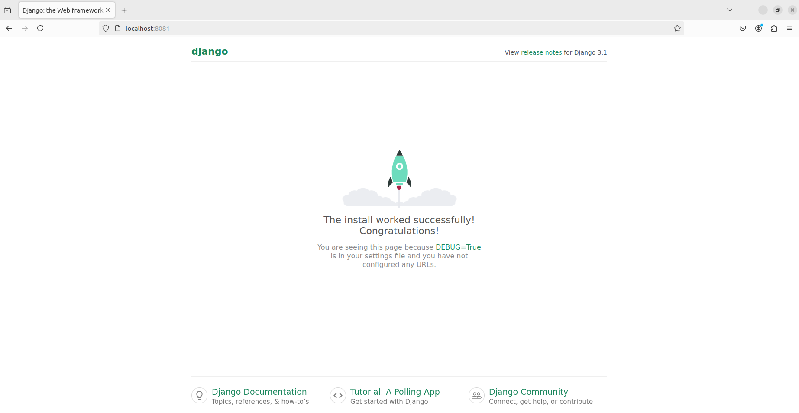
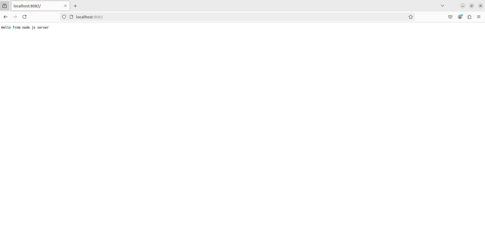
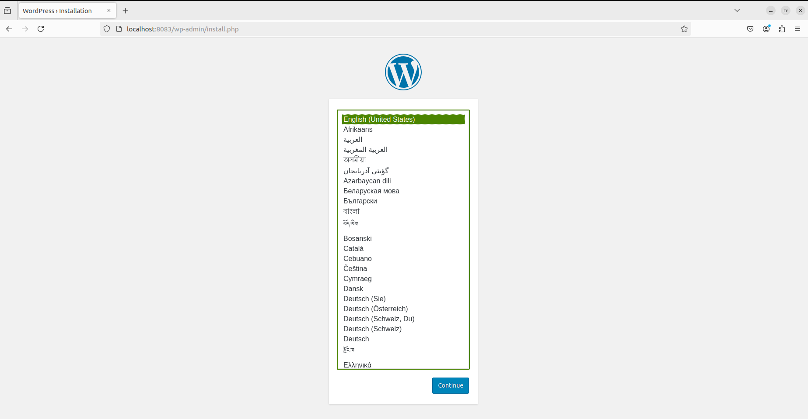

# Задание 27 (Развертывание веб приложения)

Стенд состоит из виртуальной машины с nginx + php-fpm (wordpress) + python (django) + js(node.js) с деплоем через docker-compose.

На хостовую машину пробрасываются следующие порты:

**8081** - django

**8082** - node.js

**8083** - wordpress

После разворачивания стенда командой `vagrant up`, проверяем результат:

На развёрнутой виртуальной машине смотрим запущенные docker контейнеры:

```bash
root@DynamicWeb:~# docker ps --format "table {{.Image}}\t{{.Names}}\t{{.Status}}\t{{.Ports}}"
IMAGE                        NAMES       STATUS          PORTS
nginx:1.15.12-alpine         nginx       Up 14 minutes   80/tcp, 0.0.0.0:8081-8083->8081-8083/tcp, :::8081-8083->8081-8083/tcp
wordpress:5.1.1-fpm-alpine   wordpress   Up 14 minutes   9000/tcp
mysql:8.0                    database    Up 14 minutes   3306/tcp, 33060/tcp
node:16.13.2-alpine3.15      node        Up 14 minutes   
files-app                    app         Up 14 minutes   
root@DynamicWeb:~# 
```

А с хоста проверяем доступность:

http://localhost:8081

[](8081.PNG)

http://localhost:8082

[](8082.PNG)

http://localhost:8083

[](8083.PNG)